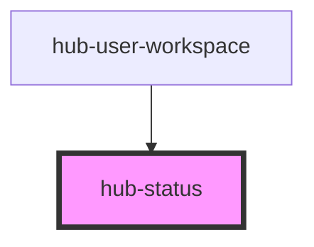

# hub-status

<!-- Auto Generated Below -->

## Properties

| Property    | Attribute    | Description | Type     | Default                                             |
| ----------- | ------------ | ----------- | -------- | --------------------------------------------------- |
| `statusUrl` | `status-url` |             | `string` | `'https://arcgis.github.io/hub-status/status.json'` |

## Dependencies

### Used by

 - [hub-user-workspace](../hub-user-workspace)

### Graph

----------------------------------------------

*Built with [StencilJS](https://stenciljs.com/)*
