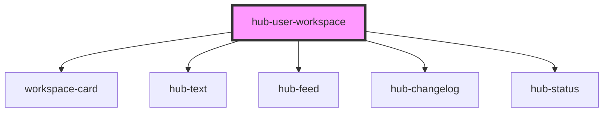

# hub-user-workspace

<!-- Auto Generated Below -->

## Dependencies

### Depends on

- [workspace-card](../workspace-card)
- [hub-text](../hub-text)
- [hub-feed](../hub-feed)
- [hub-changelog](../hub-changelog)
- [hub-status](../hub-status)

### Graph

----------------------------------------------

*Built with [StencilJS](https://stenciljs.com/)*
