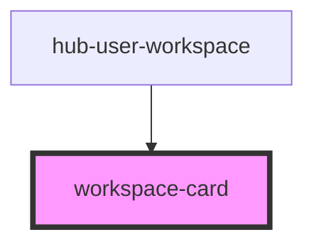

# workspace-card

Generic wrapper for any component to be a "Workspace Card"

Example

```html
<workspace-card>
  <h2>Recent Updates</h2>
  <arcgis-hub-gallery
    gallery-type="item"
    query="Escondido"
    layout="list"
  />
</workspace-card>
```

<!-- Auto Generated Below -->


## Dependencies

### Used by

 - [hub-user-workspace](../hub-user-workspace)

### Graph


----------------------------------------------

*Built with [StencilJS](https://stenciljs.com/)*
